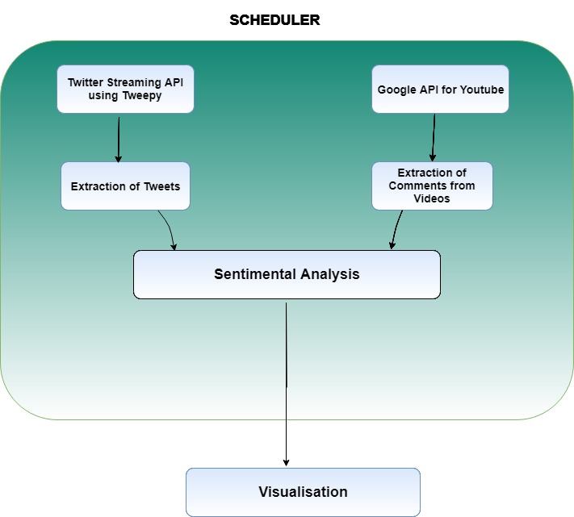

# Access-Point-Experience-Dashboard
To collect feedbacks posted by customers on social media platforms about access points *(pickup points/stores, Amazon lockers and hubs) and create an* **Experience Dashboard** to understand customer requirements and experience with above mentioned access points in different countries.

### How it Works?

### Data Sources
 * YouTube
 * Twitter
 ### Tools Used
 * Vader sentiment analysis
 * Tableau for Visualization
